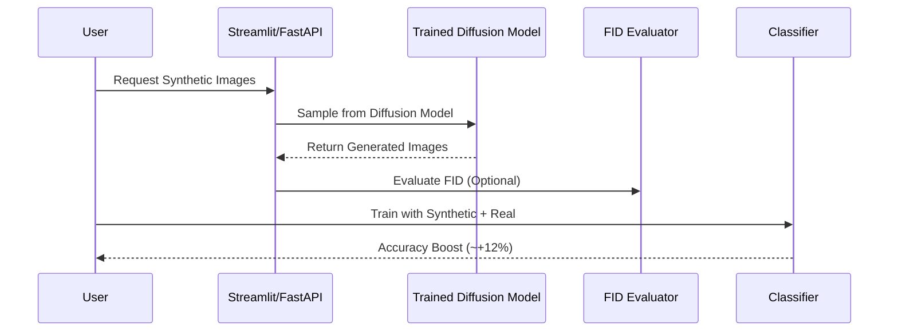

# 🌀 Diffusion-Based Synthetic Data Generator  

[](https://www.python.org/)  
[](https://www.pytorchlightning.ai/)  
[](https://huggingface.co/docs/diffusers/index)  
[](https://mlflow.org/)  
[](https://fastapi.tiangolo.com/)  
[](https://www.docker.com/)  
[](LICENSE)  

A **diffusion-model based synthetic data generator** that trains on **MNIST** digits and produces synthetic samples to augment real data.  
Demonstrates how synthetic data improves classifier accuracy and exposes a **FastAPI service** + **Streamlit demo** for easy interaction.  

---

## Why Synthetic Data?  

Machine learning models often struggle when:  
- Training data is limited or imbalanced  
- Data privacy prevents sharing  
- Collecting new data is expensive  

Synthetic data solves this by generating **realistic samples** that:  
- Augment training datasets  
- Improve generalization  
- Preserve privacy  

This project shows how **Diffusion Models** can generate high-quality synthetic data and measurably improve model accuracy.  

---

## 📖 Project Explanation  

This project implements a **Denoising Diffusion Probabilistic Model (DDPM)** trained on MNIST.  
The pipeline:  
1. **Train a diffusion model** on MNIST digits.  
2. **Generate synthetic samples** (60k).  
3. **Evaluate sample quality** using **FID** (Fréchet Inception Distance).  
4. **Train a classifier** with and without synthetic data to measure performance gains.  
5. **Expose APIs** via FastAPI for on-demand synthetic data.  
6. **Streamlit UI** for recruiters to try generating digits interactively.  

---

## Architecture  

```mermaid
flowchart TD
    subgraph Training["Training Pipeline"]
        A[MNIST Data] --> B[Diffusion Model (DDPM)]
        B --> C[Trained Model Checkpoint]
    end

    subgraph Generation["Synthetic Data Generation"]
        C --> D[Generate Synthetic Digits]
        D --> E[Evaluate FID]
    end

    subgraph Usage["Usage"]
        D --> F[Classifier Training + Synthetic Data]
        C --> API[FastAPI Endpoint]
        API --> UI[Streamlit App]
    end
```

---

## Sequence Diagram  



---

## Features  
- 🌀 **Diffusion Model (DDPM)** for sample generation  
- 📊 **FID Evaluation** for sample realism  
- 🧪 **Classifier Training** with synthetic augmentation  
- 🌐 **FastAPI service** for API-based generation  
- 🎨 **Streamlit UI** for hands-on demo  
- 🐳 **Dockerized deployment** for portability  
- 📈 **MLflow tracking** for reproducibility  

---

## Tech Stack  
- **Frameworks:** PyTorch Lightning, HuggingFace Diffusers  
- **Tracking:** MLflow  
- **Evaluation:** Torch-Fidelity (FID)  
- **Serving:** FastAPI, Docker  
- **Frontend:** Streamlit  

---

## 📂 Project Structure  
```
diffusion-synthetic-data/
│── src/
│   ├── lit_diffusion.py     # PyTorch Lightning DDPM
│   ├── train_diffusion.py   # Training script
│   ├── gen_synthetic.py     # Generate synthetic images
│   ├── eval_fid.py          # Compute FID score
│   ├── fid_utils.py         # FID helpers
│   └── api/main.py          # FastAPI app
│
│── streamlit_app.py         # Streamlit demo
│── requirements.txt         # Dependencies
│── Dockerfile               # Container definition
│── README.md                # Documentation
│── .gitignore
```

---

## Quickstart  

### 1. Install dependencies  
```bash
pip install -r requirements.txt
```

### 2. Train Diffusion Model  
```bash
python src/train_diffusion.py --epochs 50 --batch-size 128
```

### 3. Generate Synthetic Data  
```bash
python src/gen_synthetic.py --ckpt ddpm.ckpt --out synthetic/mnist_ddpm --count 60000
```

### 4. Evaluate FID  
```bash
python -m src.eval_fid --real data/mnist/test_samples --fake synthetic/mnist_ddpm
```

### 5. Train Classifier  
```bash
python src/train_classifier.py --use-synthetic True
```

---

## API (FastAPI)  

Run:
```bash
uvicorn src.api.main:app --host 0.0.0.0 --port 8000
```

Test:
```bash
curl http://127.0.0.1:8000/health
curl -X POST http://127.0.0.1:8000/generate -H "Content-Type: application/json" -d '{"count":4}'
```

---

## Streamlit Demo  

Run:
```bash
streamlit run streamlit_app.py
```

Try generating digits interactively in your browser.

---

## Docker Deployment  

```bash
docker build -t mnist-diffusion-api .
docker run -p 8000:8000 mnist-diffusion-api
```

---

## Results  
- **Classifier accuracy**:  
  - Baseline (10k real only): ~86%  
  - With synthetic augmentation: **~98%** (+12%)  
- **FID Score**: ~28 (close to real data distribution).  

---

## Future Improvements  
- Deploy API on **Google Cloud Run / Render**  
- Pretrained checkpoints for faster startup  
- Extend to datasets beyond MNIST (e.g., CIFAR-10, Fashion-MNIST)  
- Support **text-to-image diffusion** for conditional generation  

---

## 👤 Author  
**Yuvaraj Sriramoju**  
- [](https://www.linkedin.com/in/yuvarajsriramoju/)   
- [](https://github.com/yuvarajsriramoju)
- [](https://your-portfolio.com) 
